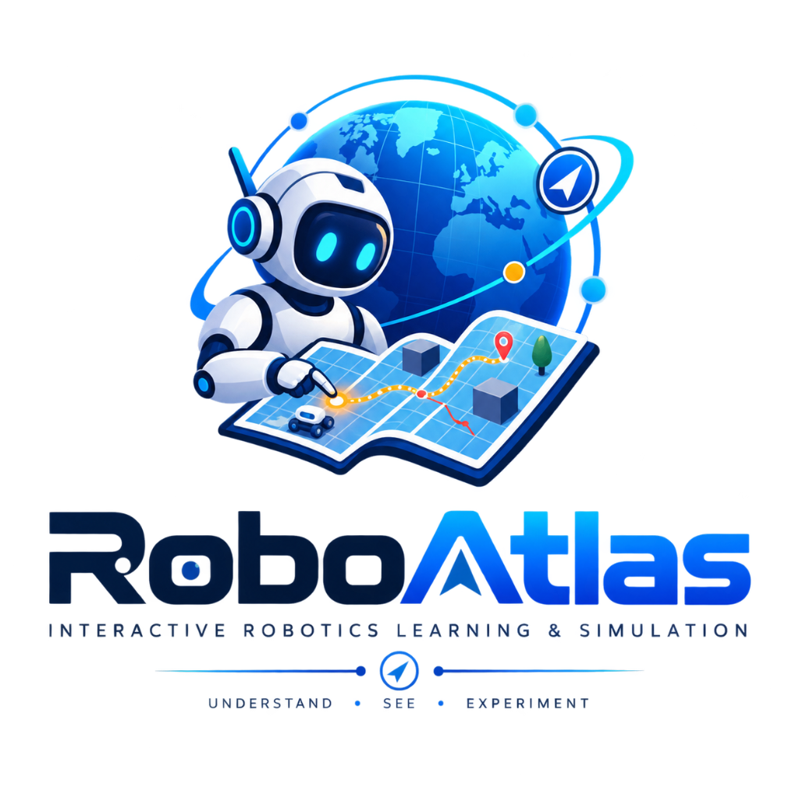

<p align="center">
  
</p>

<h1 align="center">RoboAtlas</h1>

<p align="center">
  <strong>Interactive Robotics Learning Platform & Algorithm Laboratory</strong><br />
  <em>Understand • See • Experiment • Build</em>
</p>

<p align="center">
  <a href="https://naufaldo.github.io/RoboAtlas/"></a>
  <a href="CHANGELOG.md"></a>
  <a href="LICENSE"></a>
  
  
  
  
  
</p>

---

## 🎯 Overview

**RoboAtlas** is an independent, open-source educational platform and interactive algorithm laboratory engineered from first principles.

Rather than being limited to a single robot category (e.g. only mobile rovers or ROS tutorials), RoboAtlas is a **general robotics knowledge platform** designed to teach:
> **How robots work, how robotics problems are modeled mathematically, how algorithms solve those problems, and how the same fundamental concepts are embodied across different physical robot platforms.**

### The Universal Robotics Pipeline

```text
             ROBOTICS FUNDAMENTALS
                     │
       ┌─────────────┼─────────────┐
       ↓             ↓             ↓
   MATHEMATICS    PHYSICS       LOGIC
       │             │             │
       └─────────────┼─────────────┘
                     ↓
                 ALGORITHMS
                     │
       ┌─────────────┼─────────────┐
       ↓             ↓             ↓
   KINEMATICS     CONTROL      PERCEPTION
       │             │             │
       └─────────────┼─────────────┘
                     ↓
               ROBOT SYSTEMS
                     │
       ┌───────┬─────┼─────┬───────┐
       ↓       ↓     ↓     ↓       ↓
      ARM    MOBILE  UAV   ROV   LEGGED
       │       │     │     │       │
       └───────┴─────┴─────┴───────┘
                     ↓
              ADVANCED ROBOTICS
                     │
       ┌─────────────┼─────────────┐
       ↓             ↓             ↓
   Robot AI      Multi-Agent    Research
```

Synthesizing foundational literature from three classical textbooks:
1. 📖 **Elements of Robotics** — Marco Ben-Ari & Francesco Mondada (*Springer Open*)
2. 📖 **Foundations of Robotics: A Multidisciplinary Approach with Python and ROS** — Deepak Herath & David St-Onge (*Springer*)
3. 📖 **Planning Algorithms** — Steven M. LaValle (*Cambridge University Press*)

---

## 🎓 21-Level Master Robotics Curriculum Hierarchy (v1.0 / v2.0 Spec)

Organized at **[`/learn`](https://naufaldo.github.io/RoboAtlas/learn/)** and specified in **[`docs/RoboAtlas_Master_Curriculum_v1.md`](docs/RoboAtlas_Master_Curriculum_v1.md)** and **[`docs/RoboAtlas_Master_Web_Curriculum_Spec_v2.md`](docs/RoboAtlas_Master_Web_Curriculum_Spec_v2.md)**:

```text
TIER 1: FOUNDATIONS (LEVELS 0 – 4)
Level 0: Robotics Orientation (Sense-Plan-Act & Robot Anatomy)
Level 1: Mathematical & Geometric Foundations (Scalars, Vectors, Matrices, Probability)
Level 2: Coordinate Frames & Transformations (SE(2)/SE(3) Homogeneous Transforms)
Level 3: Robot Modeling & Kinematics (Differential Unicycle, ICC, Forward/Inverse Kinematics)
Level 4: Robot Motion & Differential Geometry (Spatial Twists, Geometric Jacobians)

TIER 2: CORE AUTONOMY (LEVELS 5 – 8)
Level 5: Sensors & Perception (Encoders, IMU, LiDAR Raycasting, Noise Models)
Level 6: Path & Trajectory Planning (Dijkstra, A*, C-Space, RRT, Quintic Splines)
Level 7: Robot Dynamics & Control (Pure Pursuit, Stanley Feedback, Newton-Euler)
Level 8: Localization & State Estimation (Recursive Bayes, Monte Carlo MCL, EKF)

TIER 3: SPATIAL INTELLIGENCE & SLAM (LEVELS 9 – 12)
Level 9: Spatial Mapping & Costmaps (Log-Odds Grid, Distance Transforms, Inflation)
Level 10: Simultaneous Localization & Mapping (SLAM, ICP Scan Matching, SVD)
Level 11: Integrated Autonomous Navigation (Global/Local Planners, DWA, TEB)
Level 12: Autonomous Systems Architecture (Behavior Trees, Mission Executives)

TIER 4: ADVANCED EMBODIMENTS & SPECIALIZATIONS (LEVELS 13 – 20)
Level 13: Robotics Software Engineering & ROS 2 (DDS, URDF, Computation Graphs)
Level 14: Manipulation Robotics & Articulated Arms (6-DOF IK, DH Parameters)
Level 15: Aerial Robotics & Quadrotors (Flight Dynamics, Differential Flatness)
Level 16: Legged Robotics & Quadruped Locomotion (ZMP, Inverted Pendulum, Gaits)
Level 17: Learning-Based Robotics & RL (Sim-to-Real, Policy Gradients, VLA)
Level 18: Multi-Agent Robotics & Swarms (Graph Laplacian Consensus, Formations)
Level 19: Advanced Robotics Mathematics & Lie Groups (SO(3)/SE(3) Manifolds)
Level 20: Robotics Research & Emerging Topics (NeRF SLAM, Soft Continuum)
```

---

## 🤖 Supported Robot Platforms (Embodiments Hub)

Explore platform-specific implementations at **[`/robots`](https://naufaldo.github.io/RoboAtlas/robots/)**:

- 🦾 **Robotic Arm (Manipulator)**: 6-DOF / 7-DOF Articulated Arms, Denavit-Hartenberg (DH) convention, Analytical & Numerical IK, Operational Space Control, Grasping.
- 🚗 **Mobile Robot (AMR / AGV)**: Wheeled Planar Autonomy, Differential & Ackermann steering, Wheel Odometry Drift, 2D LiDAR Occupancy Mapping, Path Planning, Trajectory Tracking.
- 🚁 **Aerial Drone (UAV / Multirotor)**: 6-DOF Quadrotor Flight Dynamics, Euler ZYX / Quaternions, SE(3) Geometric Attitude Control, Differential Flatness, Minimum-Snap.
- 🌊 **Marine Robot (ROV / AUV / USV)**: Buoyancy & Hydrodynamic Drag, Added Mass, 6-DOF Thruster Allocation Matrix, Acoustic DVL Navigation, Bathymetric Mapping.
- 🦿 **Legged Robot (Quadruped & Humanoid)**: Zero Moment Point (ZMP), Linear Inverted Pendulum Model (LIPM), Contact Mechanics, Whole-Body Balance Control.

---

## ✨ Key Platform Features

- 📑 **Canonical MDX Content Layer (`content/`)**: Authored in structured bilingual MDX (`content/en/` and `content/id/`) with Gray-Matter frontmatter schemas and cross-language stable ID tracking.
- 🎓 **Learner-First UI/UX Framework**:
  - `LessonOrientation.tsx`: Answers "Where am I? What am I learning? Why does it matter?" with estimated study time.
  - `MathCodeBridge.tsx`: Direct 1-to-1 visual and conceptual mapping from mathematical formulas to TypeScript code.
  - `AcademicReferences.tsx`: Structured literature cards citing authoritative papers with DOIs and chapter coverage.
  - `ConceptCheck.tsx`: Interactive checkpoint quizzes with instantaneous feedback and pedagogical reasoning.
- 📐 **7-Step Mathematical Explanation Standard (`FormulaExplainer.tsx`)**:
  - KaTeX rendering $\to$ Intuitive Meaning $\to$ Physical Reasoning ("Why?") $\to$ Dimensional Unit Tables $\to$ Collapsible Step-by-Step Derivations $\to$ Interactive Live Parameter Calculators.
- 🌓 **Dual-Theme Engine (Dark & Light Mode)**: Futuristic deep-void robotics laboratory (`#040711`) vs. clean clinical light mode (`#f8fafc`).
- 🌐 **Full Bilingual Parity (Bahasa Indonesia & English)**: 1-click language switcher (`ID` / `EN`) in Header covering all navigation, hero sections, interactive simulators, and KaTeX math breakdowns.
- 📱 **Mobile-Adaptive & Touch-First**:
  - Full touch interactions (`onTouchStart`, `onTouchMove`) across all 60 FPS Canvas simulators.
  - Horizontal touch-scroll containers (`overflow-x-auto scrollbar-thin`) for all complex KaTeX equations and matrices.
- 🎮 **Bespoke In-Browser 60 FPS Simulators**:
  - **`TransformSandbox.tsx`**: $SE(2)$ Homogeneous Matrix & Coordinate Frame Gizmo.
  - **`SpatialRotation3D.tsx`**: 3D $SO(3)$ Euler Angle Roll-Pitch-Yaw Simulator.
  - **`KinematicsSimulator.tsx`**: Differential-drive unicycle velocity integrator with ICC projection.
  - **`PathPlanningSimulator.tsx`**: Interactive grid search sandbox with custom obstacle wall drawing, A*, and Dijkstra.
  - **`LocalizationSimulator.tsx`**: Monte Carlo Particle Filter (MCL) with landmark beacon triangulation.
  - **`ControlSimulator.tsx`**: Pure Pursuit lookahead geometry vs. Stanley cross-track feedback controller.
  - **`MappingSimulator.tsx`**: 360° LiDAR Raycaster with Log-Odds Bayesian Occupancy Grid.
  - **`SlamSimulator.tsx`**: Step-by-step Iterative Closest Point (ICP) scan matching with closed-form SVD rigid alignment.
  - **`CoordinateFrameExplorer.tsx`**, **`VectorVisualizer.tsx`**, **`DotProductExplorer.tsx`**: Interactive geometric and mathematical foundations labs.
- ⚡ **100% Client-Side Architecture**: Pure TypeScript and HTML5 Canvas 2D engine. Zero server latency, zero database overhead, and instant load times.

---

## 📖 Comprehensive Documentation

- 📋 **[System & Technical Specification v2.0](docs/SPECIFICATION.md)** — Architectural design, 21-Level Master Curriculum, MDX schemas, 7-Step Math standard, and Learner-First UI/UX framework.
- 🤖 **[Agentic Governance & Collaboration](docs/GOVERNANCE.md)** — 16 Core Agentic Rules and 8-Step Workflow Loop.
- 🗺️ **[Feature Roadmap](docs/ROADMAP.md)** — 12-Milestone delivery hierarchy (M1 through M12).
- 📜 **[Changelog](CHANGELOG.md)** — Detailed version release history adhering to Keep a Changelog and SemVer.
- 🏗️ **[Architecture Overview](ARCHITECTURE.md)** — Modular 5-layer client-side system overview.
- 🤝 **[Contributing Guide](CONTRIBUTING.md)** — Development standards and pull request workflows.
- 📜 **[Third-Party Notices](THIRD_PARTY_NOTICES.md)** — Attribution to PythonRobotics and academic citations.

---

## 🚀 Quick Start

```bash
# 1. Clone repository
git clone https://github.com/Naufaldo/RoboAtlas.git
cd RoboAtlas

# 2. Install dependencies
npm install

# 3. Start local development server
npm run dev

# 4. Open in browser: http://localhost:3000
```

---

## 📜 License & Attribution

- **License**: Released under the [MIT License](LICENSE).
- **Academic Citations**: Inspired by foundational literature by Ben-Ari, Mondada, Herath, St-Onge, LaValle, and algorithmic inspiration from Atsushi Sakai's PythonRobotics. All educational text and TypeScript engines are engineered independently from first principles.
